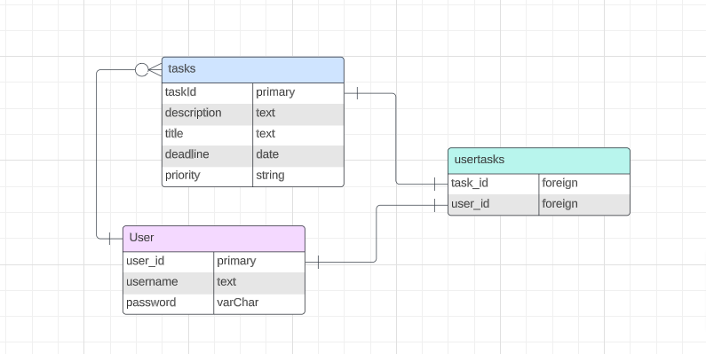
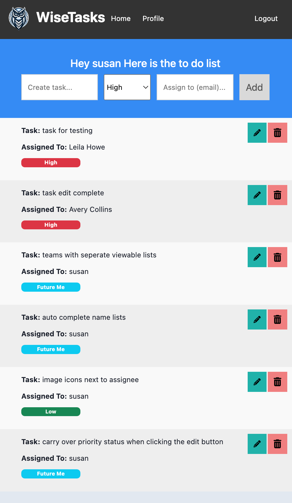
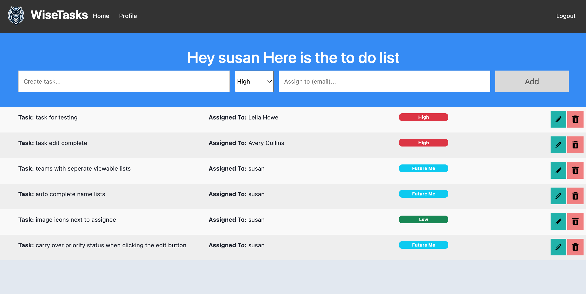
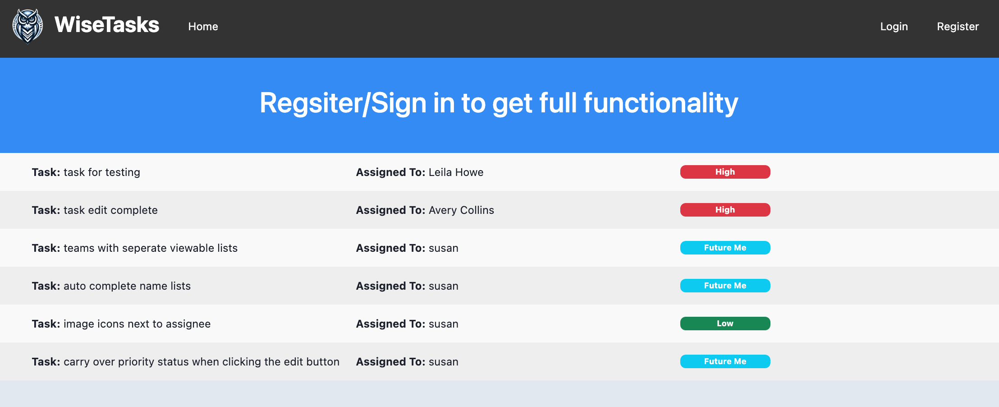
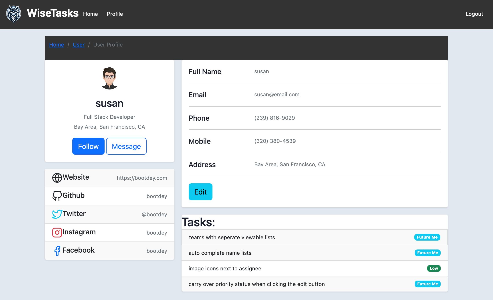

# Project Details

To Do check list App
- User Story: As a user of the to-do app, I want to be able to save my to-do list items in a database so that I can access and manage my tasks from any device and never lose my tasks.

What we can do now:
- sign up
- view all tasks
- edit tasks
- delete tasks
- personal profile to see personal tasks

----------------------------------------------------------
### ERD



----------------------------------------------------------

### Wireframes








----------------------------------------------------------

## `Express Authentication`

Express authentication template using Passport + Flash messages + custom middleware

## What it includes

* Sequelize user, tasks and usertasks model / migration
* Settings for PostgreSQL
* Passport and passport-local for authentication
* Sessions to keep user logged in between pages
* Flash messages for errors and successes
* Passwords that are hashed with BCrypt
* EJS Templating and EJS Layouts

### User Model

| Column Name | Data Type | Notes |
| --------------- | ------------- | ------------------------------ |
| id | Integer | Serial Primary Key, Auto-generated |
| name | String | Must be provided |
| email | String | Must be unique / used for login |
| password | String | Stored as a hash |
| createdAt | Date | Auto-generated |
| updatedAt | Date | Auto-generated |

### Task Model

| Column Name | Data Type | Notes |
| --------------- | ------------- | ------------------------------ |
| id | Integer | Serial Primary Key, Auto-generated |
| title | String | Must be provided |
| description | TEXT | wip |
| priority | String | drop down option |
| deadline | Date | wip |

### Default Routes

| Method | Path | Location | Purpose |
| ------ | ---------------- | -------------- | ------------------- |
| GET | / | server.js | Home page |
| GET | /auth/login | auth.js | Login form |
| GET | /auth/signup | auth.js | Signup form |
| POST | /auth/login | auth.js | Login user |
| POST | /auth/signup | auth.js | Creates User |
| GET | /auth/logout | auth.js | Removes session info |
| GET | /profile | server.js | Regular User Profile |
| GET | /profile/:userId | tasks.js | accessing users profile with userId attached
| POST | /tasks | tasks.js | posts new tasks
| PUT | /edit/:taskId | tasks.js | edit task, priority and assignee
| DELETE | /erase/:taskId | tasks.js | deletes task

## `1` Installation Instructions
`1`  `fork` and `clone` this repo

`2` Now we are going to install the current dependencies that are listed inside of `package.json`
```text
npm install
```

`3` We have the current packages for `authentication`. These are the following packages:

-  [bcryptjs](https://www.npmjs.com/package/bcryptjs): A library to help you hash passwords. ( [wikipedia](https://en.wikipedia.org/wiki/Bcrypt) ) 
    - Blowfish has a 64-bit block size and a variable key length from 32 bits up to 448 bits.
- [connect-flash](https://github.com/jaredhanson/connect-flash): The flash is an area of the session used for storing messages that will be used to to display to the user. Flash is typically used with redirects.
- [passport](https://www.passportjs.org/docs/): Passport is authentication middleware for Node.js. It is designed to do one thing authenticate requests. There are over 500+ strategies used to authenticate a user; however, we will be using one - *passport-local* Passport is authentication middleware for Node. It is designed to serve a singular purpose: authenticate requests
- [passport-local](http://www.passportjs.org/packages/passport-local/): The local authentication strategy authenticates users using a username and password. The strategy requires a verify callback, which accepts these credentials and calls done providing a user. [passport-local](http://www.passportjs.org/packages/passport-local/)
- [express-session](https://github.com/expressjs/session): Create a session middleware with given *options*.
- [method-override](https://github.com/expressjs/method-override): Lets you use HTTP verbs such as PUT or DELETE in places where the client doesn't support it.


## `2` Create Database & Update Sequelize Config

`1` Update **`config.json`** file with the following:

```json
{
  "development": {
    "database": "teamtasks",
    "host": "127.0.0.1",
    "dialect": "postgres"
  },
  "test": {
    "database": "teamtasks",
    "host": "127.0.0.1",
    "dialect": "postgres"
  },
  "production": {
    "use_env_variable": "DATABASE_URL",
    "dialect": "postgres",
    "dialectOptions": {
        "ssl": {
          "require": true,
          "rejectUnauthorized": false
        }
    }
  }
}
```

`2` Create database `express_auth_dev`

```text
sequelize db:create
```


## `3` Analyze File Structure

```text
├── config
│   └── config.json
├── controllers
│   └── auth.js
|   └── tasks.js
├── models
│   └── index.js
│   └── tasks.js
│   └── user.js
│   └── usertask.js
├── node_modules
│   └── ...
├── public
│   └── assets
│   └── css
│       └── style.css
│   └── tasklist.js
├── test
│   └── auth.test.js
│   └── index.test.js
│   └── profile.test.js
│   └── user.test.js
├── views
│   └── auth
│       └── login.ejs
│       └── signup.ejs
│   └── index.ejs
│   └── layout.ejs
│   └── profile.ejs
├── .gitignore
├── package-lock.json
├── package.json
├── README.md
├── server.js
```

- `config.json`: Where you need to configure your project to interact with your postgres database.
- `controllers`: The folder where all of your controllers ( routes ) will go to control the logic of your app.
- `models`: The folder where all the models will be stored that will interact with the database.
- `node_modules`: The folder that is generated by **npm** that stores the source code for all dependencies installed.
- `public`: is to have those views that would be publicly accessible in the application. ex. `style.css`
- `test`: The folder where all your test that you make will be stored. ex. `auth.test.js`
- `views`: The folder where all the app's templates will be stored for displaying pages to the user. ex. `login.ejs`
- `.gitignore`: A hidden file that will hide and prevent any files with to NOT get pushed to Github.
- `package-lock.json`: is automatically generated for any operations where npm modifies either the `node_modules` tree, or `package.json`.
- `package.json`: The settings file that stores scripts and list of dependencies that are used inside your app.
- `README.md`: The main markdown file that written to explain the details your app.
- `server.js`: The main file that controls the entire application.

### Roadmap
- create roles that will have permission values on what they can see and edit
- teams that can have limited members and viewing access
- assign multiple people to a single task
- have the complete status saved to database