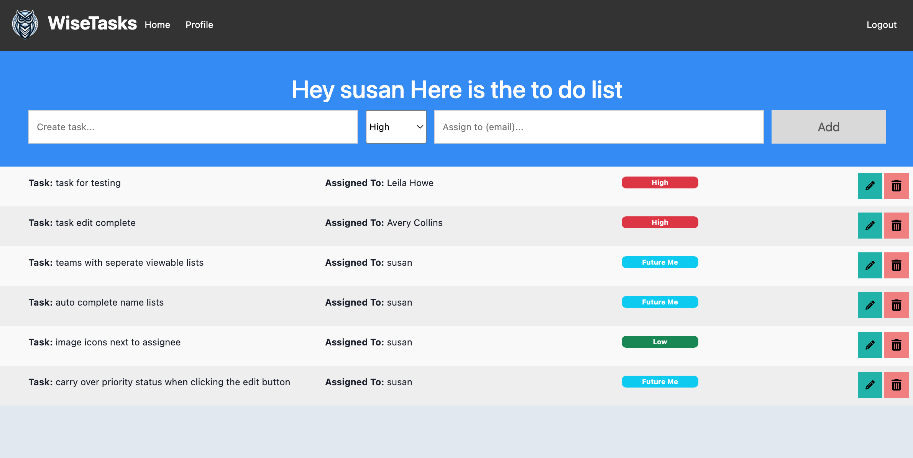
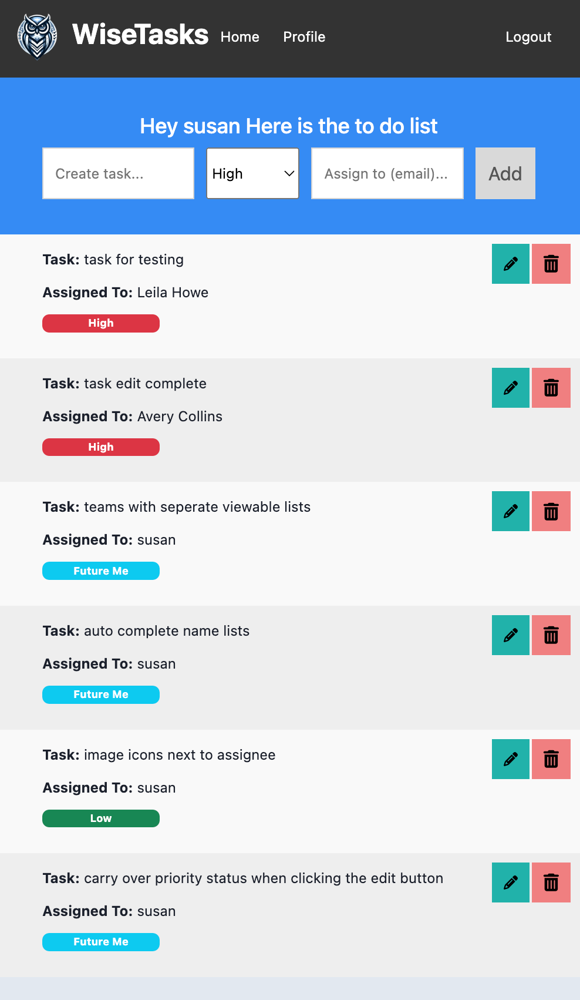

# Project 2 Planning

## Part 1

Review the Project 2 requirements and check out some [examples](https://romebell.gitbook.io/sei-802/projects/past-projects/project2).

In this space below, list **THREE** ideas for your Project 2. For each idea, include [user stories](https://www.atlassian.com/agile/project-management/user-stories) for each idea and a link to the API(s) you want to use for it.

--------------------------------------------------------
1. Bakery E Commerce 
- User Story: As a customer of the bakery shop, I want to be able to order customized cakes online so that I can easily get a cake tailored to my specific preferences for special occasions like birthdays and weddings.
2. To Do check list App
- User Story: As a user of the to-do app, I want to be able to save my to-do list items in a database so that I can access and manage my tasks from any device and never lose my tasks.
3. Quiz Maker
- User Story: As a quiz maker, I want to be able to create and manage quizzes so that I can provide engaging and educational content to my audience.
---------------------------------------------------------

Make a PR when you're done!

---

## Part 2

In the space below:
* either embed or link a completed ERD for your approved P2 idea
* if there are any changes/additions to your user stories, place your full set of revised user stories here
* either embed or link wireframes for every page of your app

----------------------------------------------------------
### ERD

----------------------------------------------------------
### User Stories
Chosen Project:
2. To Do check list App
- User Story: As a user of the to-do app, I want to be able to save my to-do list items in a database so that I can access and manage my tasks from any device and never lose my tasks.
----------------------------------------------------------
### Wireframes






----------------------------------------------------------

Make a PR when you're done!


## Requirements Inside `Project Board`

`card` FUNDAMENTALS
```
### FUNDAMENTALS
- [x] Deployed (e.g. Heroku)
- [x] Site has basic functionality related to its goal
- [x] At least 2 GET routes (other than auth)
- [x] At least 1 POST route
- [x] At least 1 DELETE route
- [x] At least 1 PUT route
```

`card` SUFFICIENT DIFFICULTY
```
### SUFFICIENT DIFFICULTY: At least 1 of the following: 
- [ ] Use of an API [does faker count? user to seed and populate fake people]
- [x] Advanced Database Relationships (1 join table)
- [ ] Sockets
- [ ] Scraping
- [ ] OAuth
- [ ] Other
```

`card` AUTH/SECURITY
```
### AUTH/SECURITY (Mostly From Template Boilerplate)
- [x] Log in works (required: boilerplate or better)
- [x] Sensible error messages for bad login info  (boilerplate or better)
- [x] Passwords hashed in database
- [x] Passwords in form are input type="password" (dots)
- [x] Password verification is checked
- [?] Can't sneak edit/delete data that I don't own by typing in random ids
```
`card` GITHUB USAGE
```
### GITHUB USAGE
- [x] Appropriate Use of Github
- [x] `README` is included and is descriptive
- [x] `.gitignore` properly set up
- [x] No API keys in Github code (used a .env file)
- [x] Multiple commits per day
- [x] Repo up on day 1 of project week or sooner
- [ ] `README` has *Installation Instructions*
```

`card` DATABASE USAGE
```
### DATABASE USAGE
- [x] At least 2 Models other than join tables (required) [users and tasks]
- [x] Relationships were set up appropriately between models
- [x] Avoided global variables, storing data in files, etc
- [x] No raw file/image data stored in database, etc
```

`card` CODE STYLE
```
### CODE STYLE
- [x] Generally DRY code / No enormous files
- [x] Proper indentation (or mostly pretty good!)
- [x] Naming conventions kept
- [x] No glaring logic errors
```
`card` USER EXPERIENCE
```
### USER EXPERIENCE
- [x] Effort was put into design
- [x] No broken links (server errors or 404s)
- [x] Typing a purposely bad link renders an error ejs page
- [x] Content is responsive to screen size changes
- [x] No glaring alignment or grid errors
```
